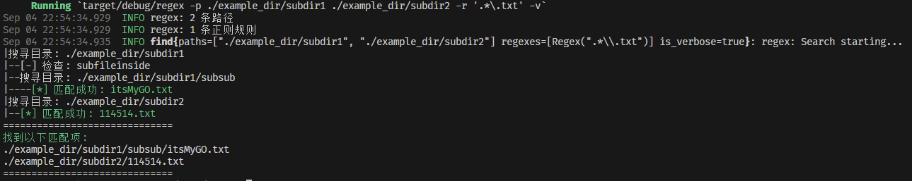
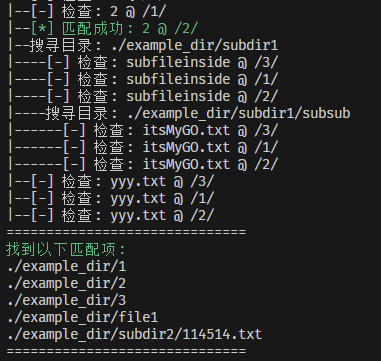

# Simple Searcher

CloudWeGo Day1 Assignment

## 提示

`example_dir`用于进行搜索测试。可以自行添加更复杂的结构。  

## Features实现情况

- 重构到多个模块中  
- ✅ `–v`/`--verbose` 搜索过程与层级显示  
- ✅ 同时⽀持匹配多个正则/给输出结果去重排序  
- ✅ 尝试使⽤ tracing 库打⽇志  
- ✅ 尝试⽀持同时搜索多个 path  
- ✅ 彩⾊输出  
- 其他：  
  - `-h` 查看帮助
  - **输出结果已去重并排序**

## Try These!
- 编译release版本并查看帮助：`cargo clean && cargo run --release -- -h && cd ./target/release/`
- 查找`example_dir`下的所有`txt`文件：`regex -p './example_dir' -r '.*\.txt'`  
- 查找`example_dir`下的所有`txt`文件以及无后缀名，并显示详细搜索过程：`regex -p './example_dir' -r '.*\.txt' '[^\.]*' -v`  
- 查找`example_dir/subdir1`和`example_dir/subdir2`下的所有文件：`regex -p './example_dir/subdir1' './example_dir/subdir2' -r '.*'`  
- 去重测试：`regex -p './example_dir/subdir1' -r '.*\.t' '.*\.txt' -v`
- 排序测试：`regex -p './example_dir' -r '3' '1' '2' -v`

## ScreenShotExample

